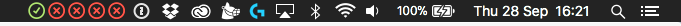

# Pipelines

> Adds your build states for your [Buildkite](https://buildkite.com) builds to your statusbar.



## Installation

### Cocoapods
```ruby
pod install
```

### GraphQL API Token
Go to [buildkite.com/user/api-access-tokens](https://buildkite.com/user/api-access-tokens) and generate a new API token.   

- Make sure you enable `GraphQL Beta (graphql)`

## Configuration
Open `Classes/Constants.swift`.  

 - Set `token` to your API token
 - `totalBuilds`: The number of builds you want to monitor (the last x)
 - `fetchInterval`: At what time interval (seconds) should the app check 

---

⚠️ *This is an unoffical app, Buildkite is in no way responsible for this or anything related to this particular product*