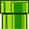
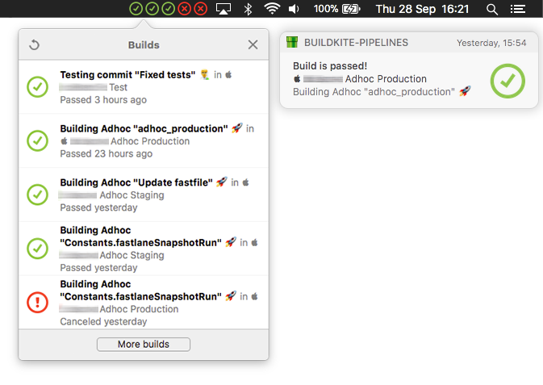

#  Pipelines

> Adds your build states for your [Buildkite](https://buildkite.com) builds to your statusbar.

[](http://forthebadge.com) [](http://forthebadge.com)

## Example



## Requirements
 - Xcode 9
 - Swift 4
 - Cocoapods 1.3
 - apollo-codegen 0.17.0-alpha.7

## Installation

### Apollo
*Requires `node`*

```
npm install -g apollo-codegen@0.17.0-alpha.7
```

### Cocoapods
```
pod install
```

### GraphQL API Token
Go to [buildkite.com/user/api-access-tokens](https://buildkite.com/user/api-access-tokens) and generate a new API token.   

- Make sure you enable `GraphQL Beta (graphql)`

## Configuration
Open `Classes/Constants.swift`.  

 - Set `token` to your API token
 - `totalBuilds`: The number of builds you want to monitor (the last x)
 - `fetchInterval`: At what time interval (seconds) should the app check 

## Dependencies
 - [Apollo](https://github.com/apollographql/apollo-ios)
 - [Macaw](https://github.com/exyte/Macaw)
 - [SwiftyUserDefaults](https://github.com/radex/SwiftyUserDefaults)
 - [EasyPeasy](https://github.com/nakiostudio/EasyPeasy)

## Todo
- [x] Notifications
- [x] Make context menu to show build information
- [x] Emoji support
- [ ] Localized
- [ ] Support all the [Buildkite custom emojis](https://github.com/buildkite/emojis)

---

## Disclaimer
- 🤷‍♂️ *I'm an iOS developer and haven't done much macOS development, so don't look to much at the code*
- ⚠️ *This is an unoffical app, Buildkite is in no way responsible for this or anything related to this particular product*